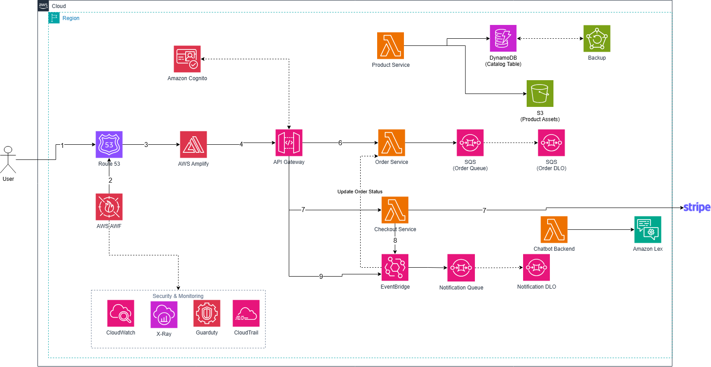

# BẢN THIẾT KẾ HỆ THỐNG v3
## DỰ ÁN: AI E-COMMERCE PLATFORM — AWS SERVERLESS ARCHITECTURE

**Vai trò soạn thảo:** Team Lead / Project Manager / Solution Architect  
**Quy mô nhóm:** 05 thành viên  
**Trạng thái:** Kiến trúc mục tiêu dùng cho Proposal, Worklog, Workshop và báo cáo cuối kỳ  
**Phiên bản:** v3 — đồng bộ với sơ đồ kiến trúc đã cập nhật  

---

## 0. LỊCH SỬ CẬP NHẬT

| Phiên bản | Nội dung chính |
|---|---|
| v1 | Kiến trúc container/microservices dùng ECS Fargate, RDS và nhiều dịch vụ AI. |
| v2 | Chuyển sang kiến trúc serverless với Amplify, API Gateway, Lambda, DynamoDB, Cognito và Lex. |
| **v3** | Bổ sung WAF rules, Cognito Authorizer, SQS + DLQ, EventBridge, Notification Service, Stripe Idempotency, X-Ray, GuardDuty và AWS Backup; chuẩn hóa luồng dữ liệu, phân công nhóm và tiêu chí nghiệm thu. |
| **v3.1** | Phụ lục A: mở rộng Notification Service với OTP (Cognito CustomMessage trigger), SMS (SNS trực tiếp) và Campaign marketing (bulk send). Không thay đổi kiến trúc lõi v3, chỉ bổ sung nhánh xử lý mới trong Notification Service theo đúng yêu cầu ở mục 18 (mọi thay đổi kiến trúc phải cập nhật tài liệu trước khi merge). |

---

## 1. MỤC TIÊU KIẾN TRÚC

Hệ thống cung cấp nền tảng thương mại điện tử có khả năng:

- Hiển thị danh mục sản phẩm và ảnh sản phẩm.
- Đăng ký, đăng nhập và phân quyền người dùng.
- Tạo, tra cứu và cập nhật đơn hàng.
- Thanh toán trực tuyến qua Stripe, hạn chế thanh toán trùng.
- Hỗ trợ chatbot bằng Amazon Lex.
- Gửi thông báo bất đồng bộ sau khi tạo hoặc cập nhật đơn hàng.
- Theo dõi log, metrics, audit trail, distributed tracing và cảnh báo bảo mật.
- Tự động sao lưu dữ liệu DynamoDB.

Kiến trúc ưu tiên mô hình **AWS Serverless** nhằm giảm công việc quản trị hạ tầng, hỗ trợ tự động mở rộng và phù hợp với phạm vi dự án của nhóm 5 thành viên.

---

## 2. SƠ ĐỒ KIẾN TRÚC CHÍNH THỨC



> **Lưu ý triển khai:** AWS WAF không phải dịch vụ DNS đứng sau Route 53 theo nghĩa vật lý. Trong sơ đồ, WAF được thể hiện theo luồng logic. Khi triển khai, Web ACL phải được liên kết với lớp phân phối/endpoint được hỗ trợ, ví dụ CloudFront do Amplify quản lý hoặc API Gateway.

---

## 3. KIẾN TRÚC TỔNG QUAN

```text
User
  └─(1)→ Route 53 — phân giải tên miền
      └─(2)→ AWS WAF — managed rules, rate limiting
          └─(3)→ AWS Amplify — Next.js SSR/static content + managed CDN
              ├─→ Amazon Cognito — đăng ký, đăng nhập, cấp JWT
              └─(4)→ API Gateway — REST API + Cognito Authorizer
                  ├─(5)→ Product Service (Lambda)
                  │       ├─→ DynamoDB — catalog/product metadata
                  │       └─→ Amazon S3 — product images
                  ├─(6)→ Order Service (Lambda)
                  │       └─→ SQS Order Queue → Order DLQ
                  ├─(7)→ Checkout Service (Lambda)
                  │       ├─→ Stripe — Payment Intent + Idempotency-Key
                  │       └─→ EventBridge — publish order.placed
                  │               ├─→ Order Service — cập nhật trạng thái
                  │               └─→ SQS Notification Queue → Notification Lambda
                  │                         └─→ Notification DLQ khi xử lý thất bại
                  └─(9)→ Chatbot Backend (Lambda) → Amazon Lex

DynamoDB → AWS Backup — sao lưu hằng ngày
Toàn hệ thống → CloudWatch + CloudTrail + X-Ray + GuardDuty
```

---

## 4. CÁC CẢI TIẾN ĐÃ ĐƯỢC ÁP DỤNG TRONG v3

| Hạng mục | Trạng thái v3 | Giá trị mang lại |
|---|---|---|
| SQS Order Queue | Đã bổ sung | Tách xử lý đơn hàng khỏi request đồng bộ, hỗ trợ retry và chống quá tải đột biến. |
| Order DLQ | Đã bổ sung | Lưu message lỗi sau số lần retry cho phép để điều tra và xử lý lại. |
| EventBridge Custom Bus | Đã bổ sung | Giảm phụ thuộc trực tiếp giữa Checkout, Order và Notification. |
| Notification Queue + DLQ | Đã bổ sung | Bảo đảm gửi thông báo theo mô hình at-least-once và không làm chậm luồng checkout. |
| Cognito Authorizer | Đã bổ sung | API Gateway xác minh JWT trước khi gọi Lambda ở các route cần đăng nhập. |
| Stripe Idempotency-Key | Đã bổ sung | Hạn chế tạo nhiều Payment Intent hoặc double charge khi client gửi lại request. |
| WAF managed rules + rate limit | Đã bổ sung | Giảm rủi ro bot, request bất thường và các mẫu tấn công web phổ biến. |
| X-Ray | Đã bổ sung | Theo dõi request xuyên suốt API Gateway, Lambda, SQS và EventBridge. |
| GuardDuty | Đã bổ sung | Phát hiện hành vi đáng ngờ ở cấp tài khoản và workload. |
| AWS Backup | Đã bổ sung | Tự động hóa backup và retention cho DynamoDB. |

---

## 5. MÔ TẢ CÁC THÀNH PHẦN

### 5.1 Edge, DNS và Frontend

| Thành phần | Trách nhiệm |
|---|---|
| Route 53 | Quản lý domain và DNS record trỏ đến frontend. |
| AWS WAF | Web ACL, managed rule groups, rate-based rules và IP reputation rules. |
| AWS Amplify | Build/deploy Next.js, phục vụ SSR/static content, quản lý môi trường frontend và CDN. |

### 5.2 Identity và API

| Thành phần | Trách nhiệm |
|---|---|
| Amazon Cognito | User Pool, đăng ký/đăng nhập, xác minh email, phát hành access token và ID token. |
| API Gateway | Public API endpoint, routing, throttling, validation, CORS và Cognito Authorizer. |

### 5.3 Business Services

| Service | Trách nhiệm | Dữ liệu/Dependency |
|---|---|---|
| Product Service | Danh sách, chi tiết, tạo và cập nhật sản phẩm; sinh pre-signed URL khi tải ảnh. | DynamoDB, S3 |
| Order Service | Tạo, tra cứu, cập nhật trạng thái đơn; xử lý message đơn hàng bất đồng bộ. | DynamoDB, SQS, EventBridge |
| Checkout Service | Tạo Payment Intent, kiểm tra giỏ hàng, áp dụng Idempotency-Key và phát event `order.placed`. | Stripe, EventBridge, DynamoDB |
| Chatbot Backend | Làm lớp backend cho UI chatbot, chuẩn hóa request/response và gọi Lex Runtime. | Amazon Lex |
| Notification Service | Nhận message từ Notification Queue và gửi email/push/in-app notification. | SQS, nhà cung cấp notification phù hợp |

### 5.4 Data và Messaging

| Thành phần | Trách nhiệm |
|---|---|
| DynamoDB | Lưu catalog, order, payment reference và metadata cần thiết. |
| Amazon S3 | Lưu ảnh sản phẩm; bucket private, truy cập qua pre-signed URL hoặc CDN. |
| Amazon SQS | Buffer cho xử lý đơn hàng và thông báo; hỗ trợ retry, visibility timeout và DLQ. |
| Amazon EventBridge | Nhận domain event và phân phối đến nhiều consumer độc lập. |
| AWS Backup | Backup theo lịch, retention policy và kiểm thử restore định kỳ. |

### 5.5 Security và Observability

| Thành phần | Trách nhiệm |
|---|---|
| CloudWatch | Logs, metrics, dashboards, alarms và log retention. |
| CloudTrail | Audit hoạt động quản trị và API calls trong tài khoản AWS. |
| AWS X-Ray | Distributed tracing và phân tích độ trễ/lỗi giữa các dịch vụ. |
| GuardDuty | Threat detection và security findings. |
| IAM | Mỗi Lambda sử dụng role riêng theo nguyên tắc least privilege. |
| Secrets Manager | Lưu Stripe secret key và các secret không được hard-code. Không thể hiện trong sơ đồ để tránh rối. |

---

## 6. LUỒNG DỮ LIỆU CHI TIẾT

### Luồng 1 — Truy cập website

1. Người dùng truy cập domain của hệ thống.
2. Route 53 phân giải DNS.
3. WAF kiểm tra request bằng managed rules và rate limit.
4. Amplify trả về trang Next.js SSR hoặc static assets từ CDN.

### Luồng 2 — Xác thực người dùng

1. Người dùng chọn đăng ký hoặc đăng nhập.
2. Frontend chuyển hướng đến Cognito Hosted UI hoặc dùng Cognito SDK.
3. Cognito trả về JWT sau khi xác thực thành công.
4. Frontend gửi access token trong header `Authorization: Bearer <token>`.
5. API Gateway Cognito Authorizer xác minh token trước khi route đến Lambda.

### Luồng 3 — Tra cứu sản phẩm

1. Frontend gọi `GET /products` hoặc `GET /products/{id}`.
2. API Gateway chuyển request đến Product Service.
3. Product Service đọc metadata từ DynamoDB.
4. Ảnh sản phẩm được lấy từ S3 qua URL phù hợp.
5. Response trả về frontend theo JSON schema thống nhất.

### Luồng 4 — Tạo và xử lý đơn hàng

1. Frontend gọi `POST /orders` với JWT và `requestId` duy nhất.
2. API Gateway validate request và chuyển đến Order Service.
3. Order Service ghi trạng thái ban đầu hoặc đưa công việc vào Order Queue.
4. Consumer xử lý message, cập nhật DynamoDB và xóa message khi thành công.
5. Message lỗi vượt quá `maxReceiveCount` được chuyển sang Order DLQ.

### Luồng 5 — Thanh toán

1. Frontend gọi `POST /checkout/payment-intent`.
2. Checkout Service kiểm tra giỏ hàng, tổng tiền và quyền sở hữu đơn hàng.
3. Service tạo hoặc tái sử dụng Stripe Payment Intent bằng `Idempotency-Key`.
4. `paymentIntentId`, trạng thái và idempotency key được lưu trong DynamoDB.
5. Stripe webhook phải được xác minh chữ ký trước khi cập nhật trạng thái thanh toán.
6. Khi thanh toán hợp lệ, Checkout Service phát event `order.placed` hoặc `payment.succeeded` lên EventBridge.

### Luồng 6 — Event-driven update và notification

1. EventBridge nhận event từ Checkout Service.
2. Rule thứ nhất gọi Order Service để cập nhật order status.
3. Rule thứ hai gửi event đến Notification Queue.
4. Notification Lambda gửi email/push/in-app message.
5. Message thất bại sau nhiều lần retry được chuyển vào Notification DLQ.

### Luồng 7 — Chatbot

1. Frontend gửi nội dung chat đến API Gateway.
2. Chatbot Backend gọi Amazon Lex Runtime.
3. Lex nhận diện intent và trả response.
4. Backend chuẩn hóa response trước khi trả về UI.
5. Các intent yêu cầu dữ liệu nghiệp vụ phải gọi API nội bộ bằng quyền IAM hạn chế.

---

## 7. THIẾT KẾ API ĐỀ XUẤT

| Method | Endpoint | Auth | Service | Mục đích |
|---|---|---|---|---|
| GET | `/products` | Public | Product | Danh sách sản phẩm |
| GET | `/products/{productId}` | Public | Product | Chi tiết sản phẩm |
| POST | `/products` | Admin | Product | Tạo sản phẩm |
| PUT | `/products/{productId}` | Admin | Product | Cập nhật sản phẩm |
| POST | `/products/{productId}/image-upload-url` | Admin | Product | Sinh pre-signed upload URL |
| POST | `/orders` | User | Order | Tạo đơn hàng |
| GET | `/orders` | User | Order | Danh sách đơn của người dùng |
| GET | `/orders/{orderId}` | User/Admin | Order | Chi tiết đơn hàng |
| PATCH | `/orders/{orderId}/status` | Admin/System | Order | Cập nhật trạng thái |
| POST | `/checkout/payment-intent` | User | Checkout | Tạo Payment Intent |
| POST | `/checkout/webhook` | Stripe signature | Checkout | Nhận webhook từ Stripe |
| POST | `/chat/messages` | User/Guest tùy policy | Chatbot | Gửi câu hỏi đến Lex |

---

## 8. THIẾT KẾ DỮ LIỆU DYNAMODB

Có thể dùng một bảng single-table cho phạm vi workshop, với các key mẫu:

| Entity | PK | SK | Thuộc tính chính |
|---|---|---|---|
| Product | `PRODUCT#{productId}` | `METADATA` | name, description, price, imageKey, stock, status |
| Order | `USER#{userId}` | `ORDER#{createdAt}#{orderId}` | total, status, paymentStatus, createdAt |
| Order lookup | `ORDER#{orderId}` | `METADATA` | userId, items, total, status, paymentIntentId |
| Payment request | `ORDER#{orderId}` | `PAYMENT#{idempotencyKey}` | paymentIntentId, amount, status |
| Event processing | `EVENT#{eventId}` | `PROCESSED` | processedAt, consumer, ttl |

**Yêu cầu bắt buộc:**

- Dùng conditional write để tránh xử lý trùng.
- Không lưu Stripe secret hoặc dữ liệu thẻ trong DynamoDB.
- Bật Point-in-Time Recovery hoặc backup plan phù hợp.
- Thiết kế GSI theo access pattern thực tế, không tạo GSI chỉ để “phòng khi cần”.

---

## 9. RELIABILITY VÀ ERROR HANDLING

### SQS

- Cấu hình `visibilityTimeout` lớn hơn thời gian xử lý tối đa của consumer.
- Cấu hình `maxReceiveCount` trước khi chuyển sang DLQ.
- Lambda consumer phải idempotent vì SQS có thể giao message nhiều hơn một lần.
- Tạo CloudWatch Alarm cho `ApproximateNumberOfMessagesVisible` và số message trong DLQ.

### EventBridge

- Định nghĩa event schema có `source`, `detail-type`, `version`, `eventId`, `timestamp` và `detail`.
- Consumer không phụ thuộc trực tiếp vào implementation của producer.
- Có cơ chế replay hoặc re-drive cho event/message lỗi.

### Stripe

- Dùng idempotency key ổn định cho cùng một yêu cầu thanh toán.
- Xác minh webhook signature.
- Không tin trạng thái “success” từ frontend; trạng thái cuối cùng phải dựa trên webhook/backend verification.

### DynamoDB

- Dùng conditional expression cho thay đổi trạng thái đơn hàng.
- Có retry với exponential backoff cho lỗi tạm thời.
- Backup định kỳ và thực hiện ít nhất một lần kiểm thử restore trước demo cuối kỳ.

---

## 10. SECURITY BASELINE

| Lớp | Yêu cầu |
|---|---|
| Edge | WAF managed rules, rate-based rule, HTTPS-only, security headers. |
| Identity | Cognito password policy, email verification, MFA tùy phạm vi, JWT expiration hợp lý. |
| API | Cognito Authorizer, request validation, throttling, CORS whitelist, không dùng wildcard khi production. |
| IAM | Mỗi Lambda một role riêng; chỉ cấp action và resource cần thiết. |
| Secrets | Stripe secret lưu trong Secrets Manager; không commit `.env`. |
| S3 | Block Public Access, encryption at rest, pre-signed URL có thời hạn ngắn. |
| DynamoDB | Encryption mặc định, PITR/backup, IAM condition khi phù hợp. |
| Logging | Không log access token, secret, dữ liệu thẻ hoặc PII không cần thiết. |
| Audit | CloudTrail bật ở cấp account; log bucket có retention policy. |
| Detection | GuardDuty findings được chuyển thành cảnh báo xử lý được. |

---

## 11. OBSERVABILITY VÀ SLO ĐỀ XUẤT

### Dashboard chính

- API Gateway: request count, 4XX, 5XX, latency.
- Lambda: invocations, errors, throttles, duration, concurrent executions.
- SQS: queue depth, age of oldest message, DLQ messages.
- DynamoDB: throttled requests, consumed capacity, system errors.
- Checkout: payment success rate, duplicate request count, webhook failures.
- Notification: processing success/failure và retry count.

### Alarm tối thiểu

- API 5XX vượt ngưỡng trong 5 phút.
- Lambda error rate vượt ngưỡng.
- Có message trong Order DLQ hoặc Notification DLQ.
- `ApproximateAgeOfOldestMessage` vượt SLA xử lý.
- Stripe webhook thất bại liên tiếp.
- GuardDuty finding mức Medium/High.

### SLO tham khảo cho workshop

- API availability: ≥ 99,5% trong thời gian demo/test.
- P95 latency cho catalog API: < 1 giây trong tải thử nghiệm.
- Order event processing: 95% message được xử lý trong 60 giây.
- Không có message tồn trong DLQ trước buổi demo cuối kỳ.

---

## 12. CẤU TRÚC MONOREPO

```text
ecommerce-platform/
├── apps/
│   └── web/                         # Next.js + Amplify
│       ├── app/
│       ├── components/
│       ├── lib/auth/
│       ├── lib/api/
│       ├── lib/chat/
│       └── amplify.yml
│
├── services/
│   ├── product-service/
│   │   ├── src/handler.ts
│   │   ├── src/repository.ts
│   │   └── tests/
│   ├── order-service/
│   │   ├── src/api-handler.ts
│   │   ├── src/order-consumer.ts
│   │   └── tests/
│   ├── checkout-service/
│   │   ├── src/payment-intent.ts
│   │   ├── src/stripe-webhook.ts
│   │   └── tests/
│   ├── notification/                # tên thư mục thật trong repo (không phải notification-service)
│   │   ├── src/consumer.ts
│   │   └── tests/
│   └── chatbot-backend/
│       ├── src/handler.ts
│       └── tests/
│
├── infra/
│   ├── bin/app.ts
│   └── lib/
│       ├── edge-stack.ts            # Route 53, WAF
│       ├── frontend-stack.ts        # Amplify config/integration
│       ├── auth-stack.ts            # Cognito
│       ├── data-stack.ts            # DynamoDB, S3, Backup
│       ├── messaging-stack.ts       # SQS, DLQ, EventBridge
│       ├── api-stack.ts             # API Gateway, Lambda wiring
│       ├── security-stack.ts        # IAM, Secrets Manager, GuardDuty
│       └── observability-stack.ts   # CloudWatch, CloudTrail, X-Ray
│
├── packages/
│   ├── shared-types/
│   ├── event-schemas/
│   └── shared-utils/
│
├── docs/
│   ├── architecture-v3.md
│   ├── api-contract.md
│   ├── runbook.md
│   ├── adr/
│   └── worklog/
│
├── .github/workflows/
│   ├── ci.yml
│   ├── deploy-dev.yml
│   └── deploy-prod.yml
│
├── pnpm-workspace.yaml
└── README.md
```

---

## 13. CI/CD VÀ MÔI TRƯỜNG

### Nhánh Git

- `main`: protected branch.
- `develop`: tích hợp trước khi release, nếu nhóm cần.
- `feature/<member>-<task>`: nhánh chức năng.
- Mỗi pull request cần ít nhất 01 reviewer khác tác giả.

### Pipeline tối thiểu

1. Install dependency.
2. Lint và type-check.
3. Unit test.
4. Build frontend và Lambda package.
5. IaC diff/synth.
6. Deploy môi trường dev sau khi merge.
7. Chạy smoke test.
8. Production deploy dùng manual approval.

### Môi trường

- `dev`: dùng cho phát triển và tích hợp.
- `staging`: kiểm thử end-to-end và demo nội bộ.
- `prod/demo`: môi trường trình bày cuối kỳ, dữ liệu được làm sạch trước demo.

---

## 14. PHÂN CÔNG NHÓM 5 THÀNH VIÊN

| Thành viên | Vai trò | Trách nhiệm chính | Deliverables |
|---|---|---|---|
| **Member 1** | Frontend & Identity Engineer | Next.js, Amplify, Cognito UI/SDK, route protection, checkout UI, chatbot UI. | Frontend app, auth flow, UI test, Amplify deployment. |
| **Member 2** | API & Compute Engineer | API Gateway, Product Service, Order API, request validation, Cognito Authorizer. | API contract, Product/Order Lambda, unit tests. |
| **Member 3** | Data & Messaging Engineer | DynamoDB access patterns, S3, SQS, DLQ, EventBridge, Backup. | Data model, queues, event rules, backup/restore evidence. |
| **Member 4** | Payment, AI & Notification Engineer | Checkout Lambda, Stripe integration/webhook, Lex, Notification Service. | Payment flow, chatbot intents, notification consumer, integration tests. |
| **Member 5 — Team Lead/PM** | DevSecOps & Observability | Kiến trúc, CDK, IAM, WAF, Secrets, CI/CD, CloudWatch, CloudTrail, X-Ray, GuardDuty, quản lý tiến độ. | Architecture docs, deployment pipeline, dashboards, runbook, release/demo plan. |

### Trách nhiệm của Team Lead / Project Manager

- Chốt phạm vi MVP và quản lý thay đổi.
- Chia backlog theo service và phụ thuộc kỹ thuật.
- Tổ chức planning, daily/weekly sync, review và retrospective.
- Kiểm tra tiêu chuẩn code review, branch protection và Definition of Done.
- Theo dõi rủi ro, chi phí, tiến độ và chất lượng tài liệu.
- Điều phối integration test và buổi demo cuối kỳ.

---

## 15. LỘ TRÌNH 12 TUẦN

| Giai đoạn | Tuần | Nội dung | Owner chính | Kết quả |
|---|---:|---|---|---|
| Khởi tạo | 1 | Chốt scope, backlog, ADR, repo, coding standards | Team Lead | Proposal + repo skeleton |
| Nền tảng | 2–3 | Amplify, Next.js, Cognito, Route 53, WAF baseline | Member 1 + 5 | Frontend và auth chạy trên dev |
| Data/API | 4–5 | DynamoDB, S3, Product API, API Gateway contract | Member 2 + 3 | Catalog end-to-end |
| Order | 6 | Order API, SQS Order Queue, Order DLQ | Member 2 + 3 | Tạo/tra cứu đơn và retry test |
| Checkout | 7–8 | Stripe Payment Intent, idempotency, webhook verification | Member 4 | Thanh toán sandbox end-to-end |
| Event-driven | 9 | EventBridge, cập nhật order, Notification Queue/DLQ | Member 3 + 4 | Event và notification flow |
| AI | 10 | Amazon Lex intents, chatbot backend và UI | Member 1 + 4 | Chatbot demo |
| Hardening | 11 | IAM, Secrets, X-Ray, GuardDuty, alarms, backup restore | Member 5 | Security/observability evidence |
| Release | 12 | E2E test, load test nhẹ, runbook, báo cáo, rehearsal | Cả nhóm | Final demo + documentation |

---

## 16. DEFINITION OF DONE

Một hạng mục chỉ được xem là hoàn thành khi:

- Code đã merge qua pull request và có reviewer.
- Lint, type-check và unit test thành công.
- Không hard-code secret.
- IAM permission đã được rà soát.
- Có log có cấu trúc và correlation/request ID.
- Có test cho happy path và ít nhất một failure path.
- Tài liệu API/architecture/worklog được cập nhật.
- Feature chạy thành công trên môi trường dev hoặc staging.
- Với luồng bất đồng bộ: đã kiểm thử retry và DLQ.

---

## 17. KỊCH BẢN DEMO CUỐI KỲ

1. Người dùng truy cập website và đăng ký/đăng nhập bằng Cognito.
2. Người dùng duyệt danh mục sản phẩm và xem ảnh từ S3.
3. Người dùng thêm sản phẩm vào giỏ và tạo đơn hàng.
4. Order Service xử lý request và thể hiện trạng thái queue/monitoring.
5. Người dùng thanh toán bằng Stripe sandbox.
6. Checkout Service phát event; Order Service cập nhật trạng thái.
7. Notification Service nhận queue message và gửi thông báo mô phỏng/thực tế.
8. Người dùng hỏi chatbot về sản phẩm hoặc trạng thái đơn.
9. Team Lead trình bày CloudWatch dashboard, X-Ray trace, DLQ test và backup policy.
10. Nhóm trình bày cơ chế idempotency, JWT authorizer và least-privilege IAM.

---

## 18. RỦI RO VÀ BIỆN PHÁP

| Rủi ro | Mức độ | Biện pháp |
|---|---|---|
| Vượt phạm vi do tích hợp quá nhiều dịch vụ | Cao | Chốt MVP; ưu tiên product, order, checkout, chatbot; notification có thể mock nếu thời gian hạn chế. |
| Thanh toán trùng hoặc webhook gửi lặp | Cao | Idempotency key, event ID, conditional write và consumer idempotent. |
| SQS message tồn lâu hoặc vào DLQ | Trung bình | Alarm, runbook re-drive, kiểm thử failure path trước demo. |
| IAM quá rộng | Cao | Mỗi Lambda một role, resource-level permission và review bằng CDK diff. |
| Chi phí ngoài dự kiến | Trung bình | AWS Budget, log retention ngắn ở dev, dọn tài nguyên sau workshop. |
| Khó debug request xuyên nhiều dịch vụ | Trung bình | Correlation ID, structured log, X-Ray active tracing. |
| Sơ đồ và triển khai không đồng nhất | Cao | Mọi thay đổi kiến trúc phải cập nhật ADR và tài liệu v3 trước khi merge. |

---

## 19. TIÊU CHÍ NGHIỆM THU

- Domain hoạt động qua Route 53 và HTTPS.
- WAF có managed rule group và rate-based rule.
- Amplify deploy thành công Next.js.
- Cognito login tạo JWT; route private bị chặn khi thiếu hoặc sai token.
- Product API đọc DynamoDB và ảnh từ S3.
- Order flow sử dụng SQS; message lỗi có thể đi vào DLQ.
- Checkout dùng Stripe sandbox và Idempotency-Key.
- Stripe webhook được xác minh chữ ký.
- EventBridge phân phối event đến Order và Notification flow.
- Notification Queue có DLQ.
- Chatbot gọi Amazon Lex thành công.
- CloudWatch dashboard và alarms hiển thị dữ liệu.
- Có ít nhất một X-Ray trace end-to-end.
- GuardDuty được bật hoặc có bằng chứng cấu hình theo phạm vi tài khoản.
- DynamoDB có backup policy và bằng chứng kiểm thử restore hoặc restore procedure.
- Repo có CI, code review và worklog của 5 thành viên.

---

## 20. KẾT LUẬN

Kiến trúc v3 là phiên bản chính thức cho dự án. Hệ thống giữ được sự đơn giản của mô hình serverless nhưng đã bổ sung các thành phần cần thiết về bảo mật, tính tin cậy, xử lý sự kiện, thanh toán an toàn và khả năng quan sát. Việc phân chia theo frontend, API, data/messaging, payment/AI và DevSecOps giúp 5 thành viên có thể làm việc song song, đồng thời Team Lead kiểm soát được phụ thuộc, tiến độ và chất lượng tích hợp.

---

## PHỤ LỤC A (v3.1) — MỞ RỘNG NOTIFICATION SERVICE: OTP, SMS, CAMPAIGN

> Bổ sung theo mục 18 (Rủi ro: "Sơ đồ và triển khai không đồng nhất"). Phần lõi kiến trúc v3 không đổi; đây là các nhánh xử lý mới được thêm vào Notification Service và Auth flow.

### A.1 OTP — Đăng ký / Đổi mật khẩu

- Nguồn kích hoạt: **Cognito Lambda Trigger `CustomMessage`** trên `MusicStoreUserPool`, **không** đi qua EventBridge/SQS vì Cognito trigger cần phản hồi đồng bộ trong vài giây.
- Trigger chỉ tuỳ biến nội dung; việc gửi email/SMS thật vẫn do Cognito thực hiện qua cấu hình SES/SNS nội bộ của nó.
- Áp dụng cho cả luồng SignUp (xác minh email) và ForgotPassword (đổi mật khẩu).

### A.2 SMS

- Dùng **AWS SNS Publish trực tiếp** tới số điện thoại (không qua SNS Topic trung gian), áp dụng cho OTP và thông báo hủy đơn.
- Rủi ro đã biết: nhà mạng Việt Nam có thể lọc SMS từ Sender ID chung của AWS SNS. Chấp nhận rủi ro này ở giai đoạn workshop/demo; `SmsProvider` được thiết kế dưới dạng interface để thay bằng gateway nội địa (eSMS, SpeedSMS...) sau này mà không đổi business logic.

### A.3 Campaign marketing (gửi hàng loạt)

- Admin tạo chiến dịch qua API mới → EventBridge (`CampaignRequested`) → Lambda fan-out chia batch theo segment khách hàng → **SQS Campaign Queue/DLQ riêng** (tách khỏi Notification Queue hiện có để không làm nghẽn thông báo giao dịch quan trọng) → gửi qua SES/SNS có throttle theo hạn ngạch SES.

### A.4 Thông báo hủy đơn hàng — bổ sung Rule còn thiếu

- Order Service (`product-api`) đã publish event `OrderUpdated` khi đổi trạng thái đơn (kể cả hủy), nhưng v3 **chưa có EventBridge Rule nào route event này tới Notification Queue** — đây là khoảng trống được phát hiện khi rà soát code, không phải thay đổi chủ động.
- Bổ sung: publish `DetailType: "OrderCancelled"` riêng (kèm `reason`, `cancelledBy`, `items`) khi status là "Đã hủy", và thêm Rule `OrderCancelledRule` → Notification Queue.
- Mọi event mới đều tuân thủ schema bắt buộc ở mục 9 (`source, detail-type, version, eventId, timestamp, detail`).

### A.5 Cấu trúc nội bộ Notification Service

Do phải xử lý nhiều kênh (email/SMS) và nhiều loại nội dung (OTP, xác nhận đơn, hủy đơn, campaign), `services/notification/` áp dụng cấu trúc phân lớp (domain / application / infrastructure / handlers) thay vì file đơn phẳng như các service khác trong mục 12 — đây là ngoại lệ có chủ đích cho service này, không áp dụng ngược lại cho `product-api`/`order-api` hiện có.

### A.6 Hạ tầng CDK bổ sung

- `infrastructure/lib/notification-stack.ts` (mới): SES v2 Email Identity + DKIM, Configuration Set (bounce/complaint), SQS Campaign Queue/DLQ, Campaign fan-out Lambda.
- `infrastructure/lib/backend-stack.ts`: thêm Rule `OrderCancelledRule`.
- `infrastructure/lib/auth-stack.ts`: thêm `lambdaTriggers.customMessage`.
