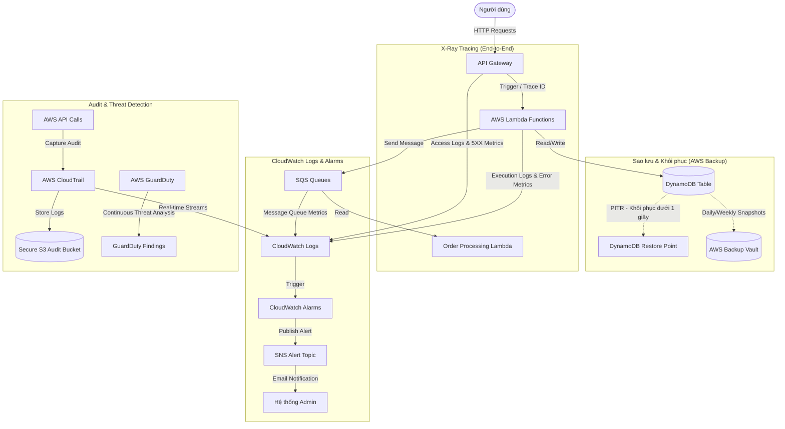

# Báo cáo Thiết kế Giám sát, Kiểm toán & Sao lưu (Monitoring, Auditing & Backup Architecture)

Hệ thống đã được bổ sung đầy đủ các giải pháp giám sát, kiểm toán lịch sử cuộc gọi API, truy vết yêu cầu (distributed tracing), hệ thống cảnh báo tự động, phát hiện hiểm họa bảo mật và giải pháp sao lưu & khôi phục tự động cho cơ sở dữ liệu.

---

## 🗺️ Sơ đồ Kiến trúc Tổng quan

---

## 🛠️ Chi tiết các dịch vụ được triển khai

Hệ thống đã được tích hợp qua 3 stack hạ tầng chính:

### 1. [database-stack.ts](file:///E:/Project/repo/music-instrument-store/infrastructure/lib/database-stack.ts) (Cơ sở dữ liệu & Sao lưu)
*   **Bật Point-in-Time Recovery (PITR)**:
    *   Kích hoạt tính năng khôi phục về bất kỳ thời điểm nào trong vòng 35 ngày qua với độ chính xác đến từng giây. Điều này bảo vệ dữ liệu khỏi các sự cố vô tình xóa hoặc cập nhật sai.
*   **AWS Backup Vault (`MusicStoreBackupVault`)**:
    *   Tạo két sắt lưu trữ bảo mật dành riêng cho các bản sao lưu cơ sở dữ liệu DynamoDB.
*   **Kế hoạch sao lưu (`MusicStoreBackupPlan`)**:
    *   **Daily Backup Rule**: Sao lưu tự động mỗi ngày lúc `00:00 UTC`, thời gian lưu giữ (retention) là **30 ngày**.
    *   **Weekly Backup Rule**: Sao lưu tự động mỗi ngày Chủ Nhật lúc `00:00 UTC`, thời gian lưu giữ là **90 ngày**.
    *   **Resource Assignment**: Tự động liên kết bảng DynamoDB (`MusicStoreMainTable`) vào kế hoạch sao lưu.

### 2. [security-stack.ts](file:///E:/Project/repo/music-instrument-store/infrastructure/lib/security-stack.ts) (Kiểm toán & Bảo mật)
*   **AWS CloudTrail (`MusicStoreCloudTrail`)**:
    *   Ghi lại toàn bộ lịch sử thao tác API trong AWS account nhằm phục vụ cho mục đích tuân thủ bảo mật và kiểm toán (audit).
    *   Tự động lưu trữ log vào một S3 Bucket chuyên dụng.
    *   Kích hoạt tính năng đồng bộ trực tiếp sang CloudWatch Logs để cho phép theo dõi thời gian thực.
*   **S3 Bucket Bảo mật cao (`MusicStoreAuditBucket`)**:
    *   Tự động mã hóa dữ liệu đầu cuối sử dụng `S3_MANAGED`.
    *   Chặn toàn bộ truy cập công cộng (`BLOCK_ALL`).
    *   Thiết lập **Lifecycle Rules**: Tự động chuyển log sang kho lưu trữ giá rẻ **Amazon S3 Glacier** sau 90 ngày và xóa vĩnh viễn sau 365 ngày để tối ưu chi phí.
*   **AWS GuardDuty (`MusicStoreGuardDuty`)**:
    *   Kích hoạt bộ phát hiện mối đe dọa thông minh (Threat Detection) dựa trên Machine Learning.
    *   Liên tục phân tích luồng log (CloudTrail, VPC Flow Logs, DNS Logs) để tìm ra các hành vi đáng ngờ.
    *   Tần suất xuất thông báo hiểm họa: 15 phút một lần để xử lý nhanh nhất có thể.

### 3. [backend-stack.ts](file:///E:/Project/repo/music-instrument-store/infrastructure/lib/backend-stack.ts) (Giám sát, Truy vết & Cảnh báo)
*   **AWS X-Ray (Distributed Tracing)**:
    *   **API Gateway**: Bật `tracingEnabled: true` giúp ghi nhận luồng yêu cầu từ lúc đi qua Gateway.
    *   **Lambda Functions**: Kích hoạt `lambda.Tracing.ACTIVE` cho toàn bộ 7 Lambda functions trong hệ thống. Luồng trace sẽ tự động kết nối từ API Gateway xuyên suốt qua Lambda và các tài nguyên tích hợp (S3, DynamoDB, SQS).
*   **CloudWatch Logs**:
    *   **Log Retention Policy**: Tất cả các Lambda function được cấu hình giới hạn thời gian lưu trữ log là **1 tuần** (`RetentionDays.ONE_WEEK`) nhằm tránh chi phí lưu trữ log vô tận.
    *   **API Gateway Execution Logs**: Bật ghi log ở mức `INFO` cùng với `dataTraceEnabled` giúp debug dễ dàng mọi payload của API.
*   **CloudWatch Alarms & SNS Notification**:
    *   Khởi tạo **Amazon SNS Topic** (`MusicStoreSystemAlarms`) để làm kênh phân phối cảnh báo (đăng ký qua email của quản trị viên).
    *   **DLQ Alarms**: Cảnh báo ngay lập tức nếu có tin nhắn bị lỗi và đẩy vào Dead Letter Queues (`OrderDLQ` và `NotificationDLQ`).
    *   **API Gateway Alarms**: Cảnh báo nếu số lượng lỗi server **5XX** vượt ngưỡng trong vòng 5 phút.
    *   **Lambda Error Alarms**: Giám sát lỗi runtime của 3 Lambda functions cốt lõi (`OrderProcessing`, `CheckoutApi`, `PaymentWebhook`).

---

## 📈 Danh sách các Metric, Alarm & Backup Schedules

### ⏰ Chu kỳ Sao lưu (AWS Backup)
*   **Hàng ngày (Daily)**: Chạy lúc `00:00 UTC` - Giữ lại 30 ngày.
*   **Hàng tuần (Weekly)**: Chạy lúc Chủ Nhật `00:00 UTC` - Giữ lại 90 ngày.
*   **PITR (Point-in-Time Recovery)**: Cho phép phục hồi bất kỳ thời điểm nào đến từng giây (trong vòng 35 ngày qua).

### 🚨 Cảnh báo CloudWatch
| Tài nguyên | Tên Metric | Ngưỡng Cảnh báo (Threshold) | Chu kỳ giám sát (Period) | Hành động khi kích hoạt |
| :--- | :--- | :--- | :--- | :--- |
| **Order Queue DLQ** | `ApproximateNumberOfMessagesVisible` | $\ge 1$ tin nhắn | 1 phút | Gửi email thông báo lỗi qua SNS |
| **Notification Queue DLQ** | `ApproximateNumberOfMessagesVisible` | $\ge 1$ tin nhắn | 1 phút | Gửi email thông báo lỗi qua SNS |
| **API Gateway** | `5XXError` | $\ge 1$ lỗi | 5 phút | Gửi email thông báo lỗi qua SNS |
| **OrderProcessing Lambda** | `Errors` | $\ge 1$ lỗi | 5 phút | Gửi email thông báo lỗi qua SNS |
| **CheckoutApi Lambda** | `Errors` | $\ge 1$ lỗi | 5 phút | Gửi email thông báo lỗi qua SNS |
| **PaymentWebhook Lambda** | `Errors` | $\ge 1$ lỗi | 5 phút | Gửi email thông báo lỗi qua SNS |

---

## 🔄 Quy trình Khôi phục DynamoDB (Restore Workflow)

### Cách 1: Khôi phục bằng Point-in-Time Recovery (PITR) - Độ chính xác theo giây
1. Đăng nhập vào AWS Console, mở dịch vụ **DynamoDB**.
2. Chọn **Tables** ở menu bên trái, sau đó click vào bảng `MusicStoreMainTable`.
3. Chuyển sang tab **Backups**.
4. Ở phần **Point-in-time recovery (PITR)**, click nút **Restore to point in time**.
5. Chọn ngày và giờ chính xác bạn muốn khôi phục về (đến từng giây).
6. Đặt tên cho bảng mới (ví dụ: `MusicStoreMainTable-Restored`).
7. Click **Restore** để bắt đầu quá trình khôi phục.

### Cách 2: Khôi phục từ Bản sao lưu theo lịch (AWS Backup)
1. Mở dịch vụ **AWS Backup** trên AWS Console.
2. Truy cập mục **Protected resources** và chọn bảng DynamoDB của bạn.
3. Chọn bản sao lưu (Recovery Point) tương ứng với thời điểm mong muốn từ danh sách.
4. Click **Restore**.
5. Nhập tên bảng DynamoDB đích mới.
6. Xác nhận để AWS Backup tự động cấu hình lại quyền hạn và khôi phục bảng.
